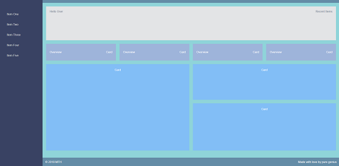

## tiny-react




Typescript app that demonstrates a tiny react implementation that can be used in 
resource constrained environments. The project has no run-time dependencies 
and uses standard webpack to bundle the project source & CSS. The complete
bundle size is 19KB.

A demonstration is available **[HERE](https://stevej2608.github.io/tiny-react/)**

The definitely typed package `@types/react` provides intellisense. The React coding
is plug-compatible with the full React implementation so you can switch to the full
React package without any code changes.

```
import React from 'react';
import './App.css';

function SideNav(props: {ref: any, onClick: any}) {
  return (
    <aside className="sidenav" ref={props.ref} onClick={props.onClick}>
      <div className="sidenav__close-icon">
        <i className="fas fa-times sidenav__brand-close"></i>
      </div>
      <ul className="sidenav__list">
        <li className="sidenav__list-item">Item One</li>
        <li className="sidenav__list-item">Item Two</li>
        <li className="sidenav__list-item">Item Three</li>
        <li className="sidenav__list-item">Item Four</li>
        <li className="sidenav__list-item">Item Five</li>
      </ul>
    </aside>
  )
}
```

The skeleton dashboard layout is taken from, [here](https://medium.com/better-programming/build-a-responsive-modern-dashboard-layout-with-css-grid-and-flexbox-bd343776a97e)


**Usage:**

        yarn
        yarn build
        yarn start

visit [http://localhost:1234/](http://localhost:1234/)

### Switching to full react

1. Remove the paths definitions from tsconfig.json

```
  "paths": {
    "react": [ ".react/react" ],
    "react-dom": [ ".react/react-dom" ],
  }
```

2. Add the required react packages 

    yarn add react react-dom

3. Delete tiny-react

    rm -rf ./src/react


**Links:**

JSX/Typescript:

* [essential-typescript](https://github.com/Apress/essential-typescript/blob/master/15%20-%20Stand-Alone%20Web%20App/webapp/src/tools/jsxFactory.ts)
* [How to Use JSX Without React](https://medium.com/better-programming/how-to-use-jsx-without-react-21d23346e5dc)
    * Example of using events
* [Using JSX in TypeScript without React](https://stackoverflow.com/questions/54144095/using-jsx-in-typescript-without-react)
* [Non React JSX](https://basarat.gitbook.io/typescript/tsx/others)
* [TypeScript and JSX without React](https://yetawf.com/BlogEntry/Title/TypeScript%20and%20JSX%20without%20React/?BlogEntry=1034)
* [Using jsx WITHOUT React](https://blog.r0b.io/post/using-jsx-without-react/)
* [Solid](https://github.com/ryansolid/solid)
* [tsx-create-element](https://www.npmjs.com/package/tsx-create-element)

CSS/Dashboard:

* [Build a Responsive, Modern Dashboard Layout With CSS Grid and Flexbox](https://medium.com/better-programming/build-a-responsive-modern-dashboard-layout-with-css-grid-and-flexbox-bd343776a97e)
    * [CSS Grid Modern Responsive Dashboard](https://codepen.io/trooperandz/pen/EOgJvg)
    * [Simple CSS Grid Dashboard](https://codepen.io/trooperandz/pen/YRpKjo)
